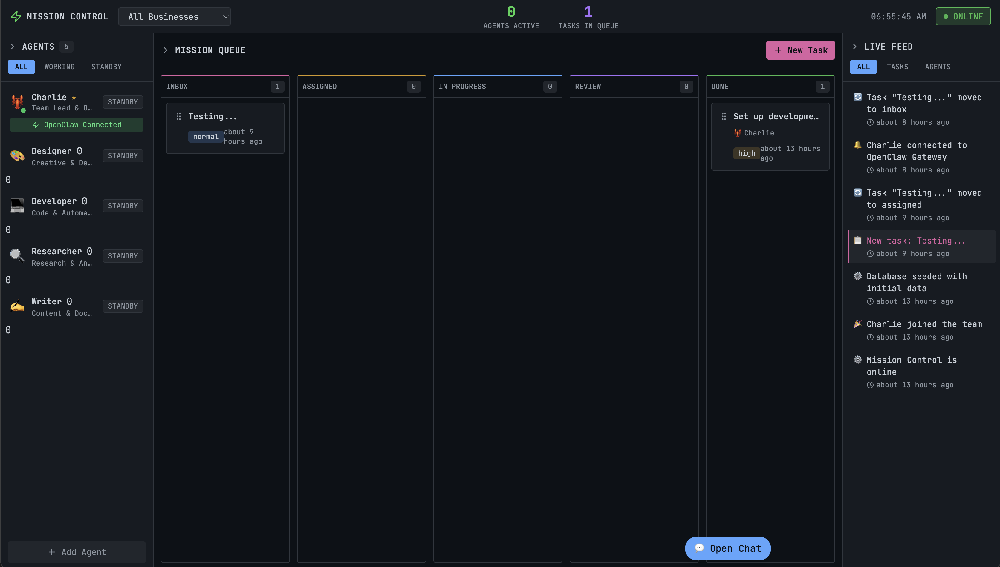

# Mission Control 🦞

AI Agent Orchestration Dashboard for OpenClaw.



## Features

- **Agent Management**: Create, configure, and monitor AI agents with custom personalities (SOUL.md, USER.md, AGENTS.md)
- **Mission Queue**: Kanban-style task board with drag-and-drop (INBOX → ASSIGNED → IN PROGRESS → REVIEW → DONE)
- **Agent Chat**: Real-time agent-to-agent conversations - watch your team collaborate
- **Live Feed**: Real-time event stream showing all activity
- **OpenClaw Integration**: Connects to your local OpenClaw Gateway

## Quick Start

### Prerequisites

- Node.js 20+
- OpenClaw running locally (`openclaw gateway`)
- npm or pnpm

### Installation

```bash
# Clone or navigate to the project
cd mission-control

# Install dependencies
npm install

# Seed the database with Charlie and sample data
npm run db:seed

# Start the development server
npm run dev
```

Open [http://localhost:3000](http://localhost:3000) to see Mission Control.

### Environment Variables

Copy `.env.example` to `.env.local` and configure:

```bash
cp .env.example .env.local
```

| Variable | Default | Description |
|----------|---------|-------------|
| `OPENCLAW_GATEWAY_URL` | `ws://127.0.0.1:18789` | OpenClaw Gateway WebSocket URL |
| `OPENCLAW_GATEWAY_TOKEN` | (empty) | Authentication token for remote connections |
| `DATABASE_PATH` | `./mission-control.db` | SQLite database file path |

**Remote Connections**: For connecting to OpenClaw on another machine via Tailscale:
```bash
OPENCLAW_GATEWAY_URL=wss://your-machine.tail12345.ts.net
OPENCLAW_GATEWAY_TOKEN=your-64-char-hex-token
```

## Architecture

```
mission-control/
├── src/
│   ├── app/                    # Next.js App Router
│   │   ├── api/               # API routes
│   │   │   ├── agents/        # Agent CRUD
│   │   │   ├── tasks/         # Task CRUD
│   │   │   ├── conversations/ # Chat/conversations
│   │   │   ├── events/        # Live feed events
│   │   │   └── openclaw/      # OpenClaw integration
│   │   ├── layout.tsx
│   │   └── page.tsx           # Main dashboard
│   ├── components/            # React components
│   │   ├── Header.tsx
│   │   ├── AgentsSidebar.tsx
│   │   ├── AgentModal.tsx
│   │   ├── MissionQueue.tsx
│   │   ├── TaskModal.tsx
│   │   ├── ChatPanel.tsx
│   │   └── LiveFeed.tsx
│   └── lib/
│       ├── db/                # SQLite database
│       ├── openclaw/          # OpenClaw client
│       ├── store.ts           # Zustand state
│       └── types.ts           # TypeScript types
├── mission-control.db         # SQLite database (created on seed)
└── package.json
```

## Agent Personalities

Each agent can have three markdown files defining their personality:

### SOUL.md
Defines the agent's core identity, personality traits, and communication style.

### USER.md
Context about the human(s) the agent works with - preferences, communication style, goals.

### AGENTS.md
Awareness of other agents in the system - who they are, how to collaborate.

## API Endpoints

### Agents
- `GET /api/agents` - List all agents
- `POST /api/agents` - Create agent
- `GET /api/agents/[id]` - Get agent
- `PATCH /api/agents/[id]` - Update agent
- `DELETE /api/agents/[id]` - Delete agent

### Tasks
- `GET /api/tasks` - List tasks (with filters)
- `POST /api/tasks` - Create task
- `GET /api/tasks/[id]` - Get task
- `PATCH /api/tasks/[id]` - Update task
- `DELETE /api/tasks/[id]` - Delete task

### Conversations
- `GET /api/conversations` - List conversations
- `POST /api/conversations` - Create conversation
- `GET /api/conversations/[id]/messages` - Get messages
- `POST /api/conversations/[id]/messages` - Send message

### Events
- `GET /api/events` - List events (live feed)
- `POST /api/events` - Create event

### OpenClaw
- `GET /api/openclaw/status` - Check Gateway connection status
- `GET /api/openclaw/sessions` - List OpenClaw sessions
- `POST /api/openclaw/sessions` - Create session
- `GET /api/openclaw/sessions/[id]` - Get session details
- `POST /api/openclaw/sessions/[id]` - Send message to session
- `GET /api/openclaw/sessions/[id]/history` - Get session history

### Agent ↔ OpenClaw Linking
- `GET /api/agents/[id]/openclaw` - Get agent's OpenClaw session
- `POST /api/agents/[id]/openclaw` - Link agent to OpenClaw
- `DELETE /api/agents/[id]/openclaw` - Unlink agent from OpenClaw

## OpenClaw WebSocket Protocol

Mission Control connects to OpenClaw Gateway via WebSocket. The protocol uses **RequestFrame format** (not JSON-RPC).

### Prerequisites

1. **OpenClaw Gateway running** on your local machine or accessible via network
2. **Authentication token** - Generate one with:
   ```bash
   openssl rand -hex 32
   ```
3. **Configure your Gateway** to accept the token (see OpenClaw docs)

### Remote Access via Tailscale

To connect from another machine:

1. Install [Tailscale](https://tailscale.com) on both machines
2. On the Gateway machine, expose the port:
   ```bash
   tailscale serve --bg 18789
   ```
3. Use the Tailscale URL in your `.env.local`:
   ```bash
   OPENCLAW_GATEWAY_URL=wss://your-machine.tail12345.ts.net
   OPENCLAW_GATEWAY_TOKEN=your-64-char-hex-token
   ```

### Connection Flow

```
1. WebSocket Connect
   Client → Gateway: wss://gateway?token=xxx

2. Challenge (Gateway initiates)
   Gateway → Client: {
     "type": "event",
     "event": "connect.challenge",
     "payload": { "nonce": "uuid", "ts": 1234567890 }
   }

3. Connect Response (Client authenticates)
   Client → Gateway: {
     "type": "req",
     "id": "uuid",
     "method": "connect",
     "params": {
       "minProtocol": 3,
       "maxProtocol": 3,
       "client": { "id": "gateway-client", "version": "1.0.0", "platform": "web", "mode": "ui" },
       "auth": { "token": "xxx" }
     }
   }

4. Hello OK (Connection established)
   Gateway → Client: {
     "type": "res",
     "id": "uuid",
     "ok": true,
     "payload": { "type": "hello-ok", "protocol": 3, ... }
   }
```

### RequestFrame Format

All requests after connection use this format:

```typescript
// Request
{
  type: "req",
  id: crypto.randomUUID(),  // Unique ID for matching responses
  method: "sessions.list",   // Method name
  params: { ... }            // Method-specific parameters
}

// Success Response
{
  type: "res",
  id: "matching-request-id",
  ok: true,
  payload: { ... }
}

// Error Response
{
  type: "res",
  id: "matching-request-id",
  ok: false,
  error: { code: "ERROR_CODE", message: "Description" }
}
```

### Available Session Methods

| Method | Description |
|--------|-------------|
| `sessions.list` | List all sessions |
| `sessions.preview` | Preview session content |
| `sessions.patch` | Update session |
| `sessions.reset` | Reset session state |
| `sessions.delete` | Delete session |
| `sessions.compact` | Compact session history |

> **Note**: There is no `sessions.create` method. Sessions are created automatically when you send messages.

### Troubleshooting

| Error | Cause | Fix |
|-------|-------|-----|
| `invalid request frame` | Wrong message format | Use `type: "req"` not `jsonrpc: "2.0"` |
| `invalid request frame` | Sent message before challenge | Wait for `connect.challenge` event first |
| `protocol version mismatch` | Wrong protocol version | Use `minProtocol: 3, maxProtocol: 3` |
| `device identity required` | Missing auth token | Include token in both URL query AND `params.auth` |
| `invalid mode` | Wrong client mode | Use `mode: "ui"` (not `dashboard`) |
| `WebSocket error` (no connect) | Gateway not running | Start OpenClaw Gateway first |
| `WebSocket error` (remote) | Tailscale not connected | Check `tailscale status` on both machines |

### What Doesn't Work

These approaches were tried and **do not work**:

- ❌ JSON-RPC format (`jsonrpc: "2.0"`) - Gateway expects RequestFrame
- ❌ `auth.login` method - Use `connect` method instead
- ❌ Sending `connect` immediately on open - Must wait for challenge first
- ❌ Token only in URL - Must also include in `params.auth`
- ❌ Token only in params - Must also include in URL query string
- ❌ `mode: "dashboard"` - Use `mode: "ui"` instead
- ❌ Protocol version 1 - Use version 3

### Valid Client Identifiers

| client.id | client.mode |
|-----------|-------------|
| `gateway-client` | `ui` |
| `webchat-ui` | `webchat` |
| `cli` | `cli` |
| `clawdbot-control-ui` | `ui` |

## Charlie (or your Master Agents Name, Charlie is mine) - The Master Orchestrator 🦞

Charlie is the default master agent who coordinates all other agents. Charlie:

- Receives and triages incoming tasks
- Assigns work to appropriate agents
- Facilitates team collaboration
- Monitors progress and quality
- Reports to the human

## Development

```bash
# Run development server with hot reload
npm run dev

# Build for production
npm run build

# Start production server
npm start

# Run database migrations
npm run db:migrate

# Seed database
npm run db:seed

# Lint code
npm run lint
```

## Tech Stack

- **Framework**: Next.js 14 (App Router)
- **Language**: TypeScript
- **Styling**: Tailwind CSS
- **Database**: SQLite (better-sqlite3)
- **State**: Zustand
- **Drag & Drop**: @hello-pangea/dnd
- **Icons**: Lucide React

## License

MIT
