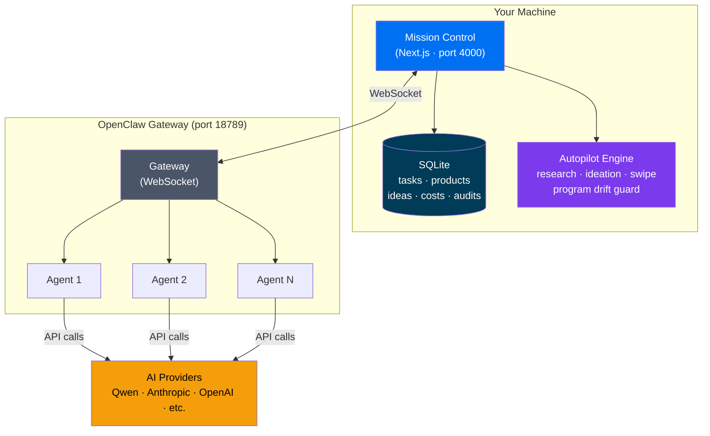
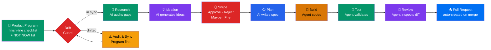
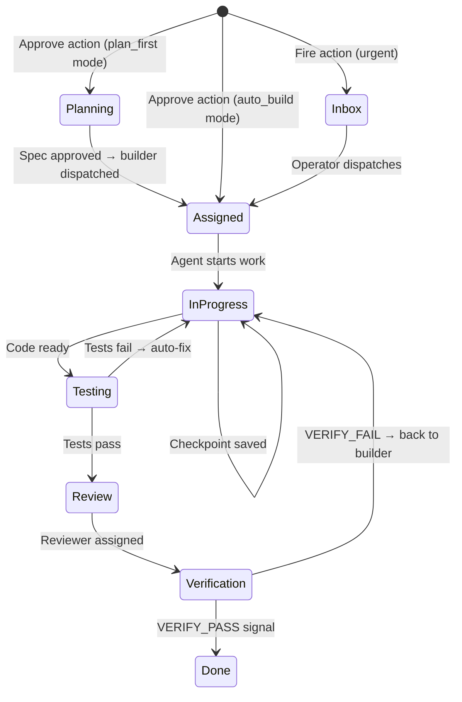
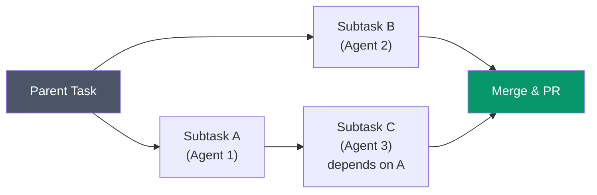
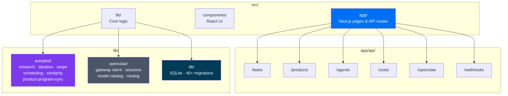

<h1 align="center">Mission Control</h1>

<p align="center">
  <em>AI Agent Orchestration Dashboard</em><br>
  Manage AI agents, assign tasks, and run autonomous product improvement pipelines via <a href="https://github.com/open-claw/open-claw-gateway">OpenClaw Gateway</a>.
</p>

<p align="center">
  
  
  
  
  
</p>

<p align="center">
  <a href="#-quick-start">Quick Start</a> •
  <a href="#-architecture">Architecture</a> •
  <a href="#-autopilot-pipeline">Autopilot</a> •
  <a href="#-features">Features</a> •
  <a href="#-configuration">Configuration</a> •
  <a href="#-documentation">Documentation</a>
</p>

---

## What Is This?

Mission Control is a self-hosted Next.js dashboard that connects to an [OpenClaw Gateway](https://github.com/open-claw/open-claw-gateway) to orchestrate AI agents. It provides:

- **Task management** — Kanban board with AI planning, agent dispatch, and checkpoint recovery
- **Product Autopilot** — Autonomous research → ideation → swipe → build → PR pipeline
- **Agent monitoring** — Real-time health, cost tracking, and convoy (parallel multi-agent) execution
- **Workspace isolation** — Git worktrees per task, no branch conflicts between agents
- **Product Program drift guard** — Blocks research/ideation from running on a stale program copy; syncs from canonical repo file

This fork is maintained by [nice-and-precise](https://github.com/nice-and-precise) and is used to run the [BoreReady](https://github.com/nice-and-precise/squti) provider-compliance project. Upstream: [crshdn/mission-control](https://github.com/crshdn/mission-control).

---

## 🏗 Architecture


```mermaid
graph TB
    subgraph YourMachine["Your Machine"]
        MC["Mission Control\n(Next.js · port 4000)"]
        DB[(SQLite\ntasks · products\nideas · costs · audits)]
        AP["Autopilot Engine\nresearch · ideation · swipe\nprogram drift guard"]
        MC --> DB
        MC --> AP
    end

    subgraph OpenClawGateway["OpenClaw Gateway (port 18789)"]
        GW["Gateway\n(WebSocket)"]
        A1["Agent 1"]
        A2["Agent 2"]
        A3["Agent N"]
        GW --> A1
        GW --> A2
        GW --> A3
    end

    MC <-->|"WebSocket"| GW
    A1 & A2 & A3 -->|"API calls"| AI["AI Providers\nQwen · Anthropic · OpenAI · etc."]

    style MC fill:#0070f3,color:#fff
    style DB fill:#003B57,color:#fff
    style AP fill:#7c3aed,color:#fff
    style GW fill:#4a5568,color:#fff
    style AI fill:#f59e0b,color:#000
```

**Mission Control** is the dashboard + autopilot engine (this repo).  
**OpenClaw Gateway** is the AI runtime that executes agent sessions ([separate project](https://github.com/open-claw/open-claw-gateway)).

---

## 🤖 Autopilot Pipeline


```mermaid
graph LR
    PP["📄 Product Program\nfinish-line checklist\n+ NOT NOW list"] --> DG{"Drift\nGuard"}
    DG -->|"in sync"| R["🔬 Research\nAI audits gaps"]
    DG -->|"drifted"| SYNC["⚠️ Audit & Sync\nProgram first"]
    SYNC --> DG
    R --> I["💡 Ideation\nAI generates ideas"]
    I --> S["👆 Swipe\nApprove · Reject\nMaybe · Fire"]
    S --> P["📋 Plan\nAI writes spec"]
    P --> B["🔨 Build\nAgent codes"]
    B --> T["🧪 Test\nAgent validates"]
    T --> V["👀 Review\nAgent inspects diff"]
    V --> PR["📤 Pull Request\nauto-created on merge"]

    style PP fill:#059669,color:#fff
    style DG fill:#dc2626,color:#fff
    style SYNC fill:#f59e0b,color:#000
    style R fill:#059669,color:#fff
    style I fill:#7c3aed,color:#fff
    style S fill:#dc2626,color:#fff
    style P fill:#2563eb,color:#fff
    style B fill:#d97706,color:#000
    style T fill:#059669,color:#fff
    style V fill:#7c3aed,color:#fff
    style PR fill:#0070f3,color:#fff
```

The **Product Program** is a markdown doc you write once that drives every research and ideation cycle. Before research runs, Mission Control compares its DB copy against the canonical file in your repo. If they've drifted, the run is blocked until you sync. After that, your only job is the **swipe**.

### Task Lifecycle


```mermaid
stateDiagram-v2
    [*] --> Inbox: Fire action (urgent)
    [*] --> Planning: Approve action (plan_first mode)
    Planning --> Assigned: Spec approved → builder dispatched
    [*] --> Assigned: Approve action (auto_build mode)
    Inbox --> Assigned: Operator dispatches
    Assigned --> InProgress: Agent starts work
    InProgress --> Testing: Code ready
    InProgress --> InProgress: Checkpoint saved
    Testing --> InProgress: Tests fail → auto-fix
    Testing --> Review: Tests pass
    Review --> Verification: Reviewer assigned
    Verification --> Done: VERIFY_PASS signal
    Verification --> InProgress: VERIFY_FAIL → back to builder
```

> **build_mode** on each product controls whether approved ideas enter `planning` (plan_first, default) or skip straight to `assigned` (auto_build).

### Convoy Mode (Parallel Agents)


```mermaid
graph LR
    PARENT["Parent Task"] --> A["Subtask A\n(Agent 1)"]
    PARENT --> B["Subtask B\n(Agent 2)"]
    A --> C["Subtask C\n(Agent 3)\ndepends on A"]
    B --> MERGE["Merge & PR"]
    C --> MERGE

    style PARENT fill:#4a5568,color:#fff
    style MERGE fill:#059669,color:#fff
```

---

## 🚀 Quick Start

> **New here?** See [GETTING_STARTED.md](GETTING_STARTED.md) for the full onboarding walkthrough — prerequisites, setup, first product, and how the autopilot pipeline works.

### Prerequisites

- **Node.js** `24.x` — pinned in `.nvmrc` ([install nvm](https://github.com/nvm-sh/nvm) then run `nvm install`)
- **OpenClaw** `2026.4.1+` on the `stable` channel
- **AI API Key** — Qwen (Alibaba), Anthropic, OpenAI, Google, OpenRouter, or other OpenClaw-supported provider

### Install & Run

```bash
git clone https://github.com/nice-and-precise/mission-control.git
cd mission-control

# Use the pinned Node version
nvm use

# Install dependencies
npm ci

# Configure
cp .env.example .env.local
# Edit .env.local — minimum required: OPENCLAW_GATEWAY_URL

# Seed initial data (agents, workspace, sample tasks)
npm run db:seed

# Start
npm run dev
```

Open **http://localhost:4000**.

> `npm run dev` auto-applies all DB migrations on boot. `db:seed` is only needed once on a fresh database to populate sample data.

### Production

```bash
npm run build
npx next start -p 4000
```

See [PRODUCTION_SETUP.md](PRODUCTION_SETUP.md) for the full production guide including PM2 and Tailscale multi-machine setup.

---

## ✨ Features

### Product Autopilot
- Autonomous market/compliance research on configurable schedules
- AI-powered ideation with impact/feasibility scoring
- Swipe interface: **Approve / Reject / Maybe / Fire** (urgent bypass)
- **Product Program drift guard** — detects when DB copy drifts from canonical repo file; blocks research/ideation until synced
- Product Program — living markdown doc that guides all AI prompts
- Preference learning from swipe history; similarity dedup suppresses recycled ideas
- Maybe Pool with auto-resurface after configurable delay

### Agent Orchestration
- Multi-agent pipeline: Builder → Tester → Reviewer → Learner
- Convoy Mode for parallel multi-agent execution with dependency DAG
- Operator Chat — queued notes + direct messages to agents mid-build
- Agent health monitoring with auto-nudge for stalled agents
- Checkpoint & crash recovery — work resumes from last save, not from scratch
- Knowledge base with cross-task learning

### Task Management
- Kanban board across 7 status columns (Inbox → Planning → Assigned → In Progress → Testing → Review → Verification → Done)
- AI planning phase with clarifying Q&A before any code is written
- Multi-agent planning specs with sub-agent definitions
- Task image attachments (UI mockups, screenshots)
- Live real-time activity feed (SSE)

### Cost & Budget
- Per-task and per-product cost tracking (dual-ledger: provider-actual + mission-estimate)
- Workspace + product budget caps (daily, monthly, per-task)
- Cost breakdown API: recorded spend, reserved dispatch cost, blocked runs

### Infrastructure
- OpenClaw Gateway integration (WebSocket)
- Gateway agent discovery & import
- Bearer token auth, HMAC webhooks, Zod validation
- Privacy first — no trackers, no centralized data collection
- Multi-machine support (Tailscale compatible)

---

## ⚙️ Configuration

### Environment Variables

| Variable | Required | Default | Description |
|:---------|:--------:|:--------|:------------|
| `OPENCLAW_GATEWAY_URL` | Yes | `ws://127.0.0.1:18789` | WebSocket URL to OpenClaw Gateway |
| `OPENCLAW_GATEWAY_TOKEN` | No | — | Auth token (only needed if gateway has auth enabled) |
| `MC_API_TOKEN` | No | — | API auth token (enables auth middleware on all routes) |
| `GITHUB_WEBHOOK_SECRET` | No | — | HMAC secret for GitHub PR-merge webhook validation |
| `DATABASE_PATH` | No | `./mission-control.db` | SQLite database location |
| `WORKSPACE_BASE_PATH` | No | `~/Documents/Shared` | Base directory for workspace files |
| `PROJECTS_PATH` | No | `~/Documents/Shared/projects` | Directory for project folders |

See [.env.example](.env.example) for the complete list with descriptions.

### Security (Production)

```bash
# Generate secure tokens
openssl rand -hex 32  # MC_API_TOKEN
openssl rand -hex 32  # GITHUB_WEBHOOK_SECRET
```

When `MC_API_TOKEN` is set, all API calls require `Authorization: Bearer <token>`. The browser UI handles this automatically via same-origin requests.

---

## 📁 Project Structure


```mermaid
graph TD
    subgraph src["src/"]
        APP["app/\nNext.js pages & API routes"]
        COMP["components/\nReact UI"]
        LIB["lib/\nCore logic"]
    end

    subgraph api["app/api/"]
        TASKS["/tasks"]
        PRODUCTS["/products"]
        AGENTS["/agents"]
        COSTS["/costs"]
        OC["/openclaw"]
        WH["/webhooks"]
    end

    subgraph libmod["lib/"]
        AUTO["autopilot/\nresearch · ideation · swipe\nscheduling · similarity\nproduct-program-sync"]
        OCLIB["openclaw/\ngateway client · sessions\nmodel catalog · routing"]
        DBLIB["db/\nSQLite · 40+ migrations"]
    end

    APP --> TASKS & PRODUCTS & AGENTS & COSTS & OC & WH
    LIB --> AUTO & OCLIB & DBLIB

    style APP fill:#0070f3,color:#fff
    style AUTO fill:#7c3aed,color:#fff
    style OCLIB fill:#4a5568,color:#fff
    style DBLIB fill:#003B57,color:#fff
```

| Directory | Purpose |
|-----------|---------|
| `src/app/api/` | Next.js API routes — tasks, products, agents, costs, OpenClaw proxy, webhooks |
| `src/components/` | React UI — Kanban board, swipe deck, agent sidebar, live feed, cost dashboard |
| `src/lib/autopilot/` | Research, ideation, swipe, preferences, scheduling, similarity, program sync |
| `src/lib/openclaw/` | Gateway WebSocket client, session management, model catalog, routing |
| `src/lib/db/` | SQLite schema + 40+ auto-running migrations |
| `docs/` | Operator runbooks, architecture docs, troubleshooting guides |
| `scripts/` | Runtime checks, docs validation, database utilities |

---

## 🗄 Database

SQLite, auto-created at `./mission-control.db`. Schema migrations run automatically on every startup — no manual migration step needed.

```bash
npm run db:seed     # Populate agents, workspace, sample tasks (first setup)
npm run db:backup   # WAL checkpoint + copy to mission-control.db.backup
npm run db:restore  # Restore from backup
npm run db:reset    # Drop and re-seed (DESTRUCTIVE — all data lost)
```

---

## 🔧 Troubleshooting

| Problem | Fix |
|---------|-----|
| Can't connect to gateway | Check `openclaw gateway status`, verify `OPENCLAW_GATEWAY_URL` in `.env.local` |
| Planning questions not loading | Check `openclaw logs --plain --limit 200`, verify AI API key |
| Port 4000 in use | `lsof -i :4000` then `kill -9 <PID>` |
| Agent callbacks failing (502) | Set `NO_PROXY=localhost,127.0.0.1` if behind a proxy |
| "Spec already locked" error | The approve route now auto-clears stale specs; if it persists, see [docs/CARD_OPERATIONS_RUNBOOK.md](docs/CARD_OPERATIONS_RUNBOOK.md) |
| Research/ideation blocked | Product Program drift detected — run **Audit & Sync Program** on the product's Program tab |

See [docs/TROUBLESHOOTING.md](docs/TROUBLESHOOTING.md) for full diagnosis procedures.

---

## 📚 Documentation

All docs are in [`docs/`](docs/) or the repo root. Start here:

### Start Here

| Document | What it covers |
|----------|---------------|
| [GETTING_STARTED.md](GETTING_STARTED.md) | Clone → configure → first product → first cycle. **Read this first.** |
| [docs/HOW-THE-PIPELINE-WORKS.md](docs/HOW-THE-PIPELINE-WORKS.md) | Full autopilot deep-dive: research, ideation, swipe, build, program sync |
| [docs/NEXT-CYCLE-PLAYBOOK.md](docs/NEXT-CYCLE-PLAYBOOK.md) | Repeatable 7-step process for running a cycle after delivery |

### Operations

| Document | What it covers |
|----------|---------------|
| [docs/CARD_OPERATIONS_RUNBOOK.md](docs/CARD_OPERATIONS_RUNBOOK.md) | Card creation, dispatch, recovery, planning approval, PR merge |
| [docs/LOCAL_OPERATIONS_RUNBOOK.md](docs/LOCAL_OPERATIONS_RUNBOOK.md) | Day-to-day local operations reference |
| [docs/AUTOPILOT_TRANSPORT_RUNBOOK.md](docs/AUTOPILOT_TRANSPORT_RUNBOOK.md) | LLM transport modes, session vs HTTP, debugging |
| [docs/TROUBLESHOOTING.md](docs/TROUBLESHOOTING.md) | Common problems and fixes |

### Reference

| Document | What it covers |
|----------|---------------|
| [docs/AGENT_PROTOCOL.md](docs/AGENT_PROTOCOL.md) | Agent communication protocol and signal format |
| [docs/ORCHESTRATION_WORKFLOW.md](docs/ORCHESTRATION_WORKFLOW.md) | Task orchestration contract and stage ownership rules |
| [docs/AUTOPILOT_SETUP.md](docs/AUTOPILOT_SETUP.md) | Autopilot configuration (schedules, budget, models) |
| [docs/PRODUCT_PROGRAM_TEMPLATE.md](docs/PRODUCT_PROGRAM_TEMPLATE.md) | Template and guide for writing a Product Program |
| [docs/USER_GUIDE.md](docs/USER_GUIDE.md) | End-user guide |
| [PRODUCTION_SETUP.md](PRODUCTION_SETUP.md) | PM2, Tailscale, reverse proxy, production config |

### For Code Agents

If you are an AI agent reading this repo:

- **Entry point:** `src/lib/db/schema.ts` — complete schema with all tables and relationships
- **Autopilot core:** `src/lib/autopilot/` — research, ideation, swipe, program sync
- **API surface:** `src/app/api/` — all routes follow Next.js App Router conventions
- **Types:** `src/lib/types.ts` — all shared TypeScript interfaces
- **Migration history:** `src/lib/db/migrations.ts` — full schema evolution
- **Task lifecycle:** See Task Lifecycle diagram above and [docs/ORCHESTRATION_WORKFLOW.md](docs/ORCHESTRATION_WORKFLOW.md)
- **DO NOT** use `src/app/api/webhooks/agent-completion/` as a reference for new webhooks — it's callback-only infra
- **DO** emit `emitAutopilotActivity()` for any new autopilot features to keep the activity feed consistent

---

## 🤝 Contributing

See [CONTRIBUTING.md](CONTRIBUTING.md) for guidelines. Quick version:

1. Fork the repository
2. Create a feature branch: `git checkout -b feature/my-change`
3. Run tests: `npm test`
4. Commit with conventional commits: `git commit -m 'feat: add thing'`
5. Push and open a Pull Request

---

## 🙏 Acknowledgments

- **[crshdn/mission-control](https://github.com/crshdn/mission-control)** — Upstream project (originally "Autensa")
- **[Andrej Karpathy](https://github.com/karpathy/autoresearch)** — AutoResearch architecture that inspired the Product Program pattern
- **[OpenClaw](https://github.com/open-claw/open-claw-gateway)** — AI agent runtime

---

## 📜 License

MIT License — see [LICENSE](LICENSE) for details.
