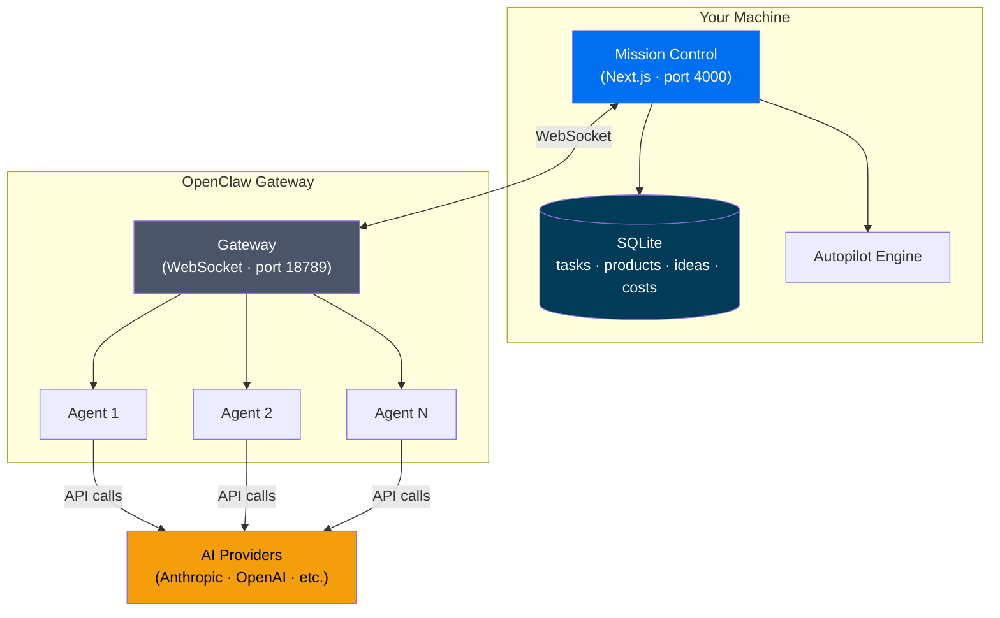
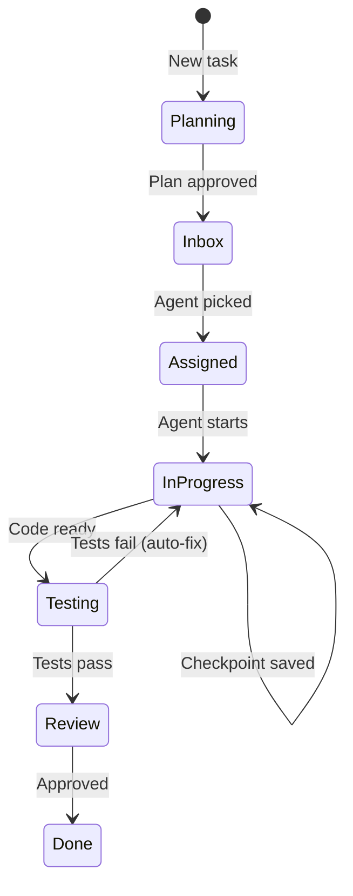
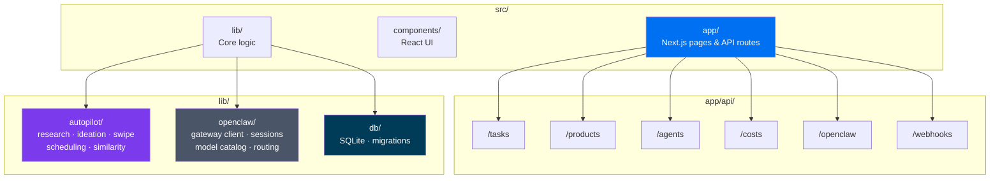

<h1 align="center">Mission Control</h1>

<p align="center">
  <em>AI Agent Orchestration Dashboard</em><br>
  Manage AI agents, assign tasks, and run autonomous product improvement pipelines via <a href="https://github.com/open-claw/open-claw-gateway">OpenClaw Gateway</a>.
</p>

<p align="center">
  
  
  
  
</p>

<p align="center">
  <a href="#-quick-start">Quick Start</a> •
  <a href="#-architecture">Architecture</a> •
  <a href="#-autopilot-pipeline">Autopilot</a> •
  <a href="#-features">Features</a> •
  <a href="#-configuration">Configuration</a> •
  <a href="#-contributing">Contributing</a>
</p>

---

## What Is This?

Mission Control is a self-hosted Next.js dashboard that connects to an [OpenClaw Gateway](https://github.com/open-claw/open-claw-gateway) to orchestrate AI agents. It provides:

- **Task management** — Kanban board with AI planning, agent dispatch, and checkpoint recovery
- **Product Autopilot** — Autonomous research → ideation → swipe → build → PR pipeline
- **Agent monitoring** — Real-time health, cost tracking, and convoy (parallel multi-agent) execution
- **Workspace isolation** — Git worktrees per task, no branch conflicts between agents

This fork is maintained by [nice-and-precise](https://github.com/nice-and-precise) and is used to run the [BoreReady](https://github.com/nice-and-precise/squti) provider-compliance project. Upstream: [crshdn/mission-control](https://github.com/crshdn/mission-control).

---

## 🏗 Architecture


```mermaid
graph TB
    subgraph Your Machine
        MC["Mission Control<br/>(Next.js · port 4000)"]
        DB[(SQLite<br/>tasks · products · ideas · costs)]
        AP["Autopilot Engine"]
        MC --> DB
        MC --> AP
    end

    subgraph OpenClaw Gateway
        GW["Gateway<br/>(WebSocket · port 18789)"]
        A1["Agent 1"]
        A2["Agent 2"]
        A3["Agent N"]
        GW --> A1
        GW --> A2
        GW --> A3
    end

    MC <-->|"WebSocket"| GW
    A1 & A2 & A3 -->|"API calls"| AI["AI Providers<br/>(Anthropic · OpenAI · etc.)"]

    style MC fill:#0070f3,color:#fff
    style DB fill:#003B57,color:#fff
    style GW fill:#4a5568,color:#fff
    style AI fill:#f59e0b,color:#000
```

**Mission Control** is the dashboard + autopilot engine (this project).
**OpenClaw Gateway** is the AI runtime that executes tasks ([separate project](https://github.com/open-claw/open-claw-gateway)).

### Autopilot Pipeline


```mermaid
graph LR
    R["🔬 Research<br/><em>AI analyzes gaps</em>"] --> I["💡 Ideation<br/><em>AI generates ideas</em>"]
    I --> S["👆 Swipe<br/><em>You decide</em>"]
    S --> P["📋 Plan<br/><em>AI writes spec</em>"]
    P --> B["🔨 Build<br/><em>Agent codes</em>"]
    B --> T["🧪 Test<br/><em>Agent runs tests</em>"]
    T --> V["👀 Review<br/><em>Agent inspects diff</em>"]
    V --> PR["📤 Pull Request<br/><em>Auto-created</em>"]

    style R fill:#059669,color:#fff
    style I fill:#7c3aed,color:#fff
    style S fill:#dc2626,color:#fff
    style P fill:#2563eb,color:#fff
    style B fill:#d97706,color:#000
    style T fill:#059669,color:#fff
    style V fill:#7c3aed,color:#fff
    style PR fill:#0070f3,color:#fff
```

Your only job is the **swipe**. Everything else is automated.

### Task Lifecycle


```mermaid
stateDiagram-v2
    [*] --> Planning: New task
    Planning --> Inbox: Plan approved
    Inbox --> Assigned: Agent picked
    Assigned --> InProgress: Agent starts
    InProgress --> Testing: Code ready
    Testing --> Review: Tests pass
    Review --> Done: Approved
    InProgress --> InProgress: Checkpoint saved
    Testing --> InProgress: Tests fail (auto-fix)
```

### Convoy Mode (Parallel Agents)


```mermaid
graph LR
    PARENT["Parent Task"] --> A["Subtask A<br/>(Agent 1)"]
    PARENT --> B["Subtask B<br/>(Agent 2)"]
    A --> C["Subtask C<br/>(Agent 3)<br/><em>depends on A</em>"]
    B --> MERGE["Merge & PR"]
    C --> MERGE

    style PARENT fill:#4a5568,color:#fff
    style MERGE fill:#059669,color:#fff
```

---

## 🚀 Quick Start

### Prerequisites

- **Node.js** `20.x` or `24.x` ([download](https://nodejs.org/) or use `nvm`)
- **OpenClaw** `2026.4.1+` on the `stable` channel
- **AI API Key** — Anthropic (recommended), OpenAI, Google, or others via OpenRouter

### Install & Run

```bash
git clone https://github.com/nice-and-precise/mission-control.git
cd mission-control

# Use the pinned Node version
nvm use

# Install dependencies
npm ci

# Configure
cp .env.example .env.local
# Edit .env.local — set OPENCLAW_GATEWAY_URL and OPENCLAW_GATEWAY_TOKEN

# Initialize the database
npm run db:seed

# Start
npm run dev
```

Open **http://localhost:4000**.

### Production

```bash
npm run build
npx next start -p 4000
```

See [PRODUCTION_SETUP.md](PRODUCTION_SETUP.md) for the full production guide including Docker, PM2, and Tailscale multi-machine setup.

---

## ✨ Features

### Product Autopilot
- Autonomous market/compliance research on configurable schedules
- AI-powered ideation with impact/feasibility scoring
- Tinder-style swipe interface (Pass / Maybe / Yes / Now!)
- Product Program — living document that guides all AI prompts ([Karpathy AutoResearch](https://github.com/karpathy/autoresearch) pattern)
- Preference learning from swipe history
- Maybe Pool with auto-resurface after configurable delay

### Agent Orchestration
- Multi-agent pipeline: Builder → Tester → Reviewer → Learner
- Convoy Mode for parallel multi-agent execution with dependency DAG
- Operator Chat — queued notes + direct messages to agents mid-build
- Agent health monitoring with auto-nudge for stalled agents
- Checkpoint & crash recovery — work resumes from last save, not from scratch
- Knowledge base with cross-task learning

### Task Management
- Kanban board with drag-and-drop across 7 status columns
- AI planning phase with clarifying Q&A before any code is written
- Multi-agent planning specs with sub-agent definitions
- Task image attachments (UI mockups, screenshots)
- Live real-time activity feed (SSE)

### Cost & Budget
- Per-task and per-product cost tracking
- Workspace + product budget caps (daily, monthly, per-task)
- Cost breakdown API: recorded spend, reserved dispatch cost, blocked runs

### Infrastructure
- OpenClaw Gateway integration (WebSocket)
- Gateway agent discovery & import
- Docker ready (`docker-compose.yml` included)
- Bearer token auth, HMAC webhooks, Zod validation
- Privacy first — no trackers, no centralized data collection
- Multi-machine support (Tailscale compatible)
- Automation tiers: Supervised / Semi-Auto / Full Auto

---

## ⚙️ Configuration

### Environment Variables

| Variable | Required | Default | Description |
|:---------|:--------:|:--------|:------------|
| `OPENCLAW_GATEWAY_URL` | Yes | `ws://127.0.0.1:18789` | WebSocket URL to OpenClaw Gateway |
| `OPENCLAW_GATEWAY_TOKEN` | Yes | — | Authentication token for OpenClaw |
| `MC_API_TOKEN` | No | — | API auth token (enables auth middleware) |
| `WEBHOOK_SECRET` | No | — | HMAC secret for webhook validation |
| `DATABASE_PATH` | No | `./mission-control.db` | SQLite database location |
| `WORKSPACE_BASE_PATH` | No | `~/Documents/Shared` | Base directory for workspace files |
| `PROJECTS_PATH` | No | `~/Documents/Shared/projects` | Directory for project folders |

See [.env.example](.env.example) for the complete list with descriptions.

### Security (Production)

```bash
# Generate secure tokens
openssl rand -hex 32  # MC_API_TOKEN
openssl rand -hex 32  # WEBHOOK_SECRET
```

When `MC_API_TOKEN` is set, all external API calls require `Authorization: Bearer <token>`. Browser UI works automatically via same-origin.

---

## 📁 Project Structure


```mermaid
graph TD
    subgraph "src/"
        APP["app/<br/>Next.js pages & API routes"]
        COMP["components/<br/>React UI"]
        LIB["lib/<br/>Core logic"]
    end

    subgraph "app/api/"
        TASKS["/tasks"]
        PRODUCTS["/products"]
        AGENTS["/agents"]
        COSTS["/costs"]
        OC["/openclaw"]
        WH["/webhooks"]
    end

    subgraph "lib/"
        AUTO["autopilot/<br/>research · ideation · swipe<br/>scheduling · similarity"]
        OCLIB["openclaw/<br/>gateway client · sessions<br/>model catalog · routing"]
        DBLIB["db/<br/>SQLite · migrations"]
    end

    APP --> TASKS & PRODUCTS & AGENTS & COSTS & OC & WH
    LIB --> AUTO & OCLIB & DBLIB

    style APP fill:#0070f3,color:#fff
    style AUTO fill:#7c3aed,color:#fff
    style OCLIB fill:#4a5568,color:#fff
    style DBLIB fill:#003B57,color:#fff
```

| Directory | Purpose |
|-----------|---------|
| `src/app/api/` | Next.js API routes — tasks, products, agents, costs, OpenClaw proxy, webhooks |
| `src/components/` | React UI — Kanban board, swipe deck, agent sidebar, live feed, cost dashboard |
| `src/lib/autopilot/` | Research, ideation, swipe logic, preferences, scheduling, similarity detection |
| `src/lib/openclaw/` | Gateway WebSocket client, session management, model catalog, routing |
| `src/lib/db/` | SQLite schema + 21 auto-running migrations |
| `docs/` | Operator runbooks, architecture docs, troubleshooting |
| `scripts/` | Runtime checks, docs validation, database utilities |

---

## 🗄 Database

SQLite, auto-created at `./mission-control.db`. Migrations run automatically on startup.

```bash
npm run db:seed    # Initialize with schema
npm run db:backup  # WAL checkpoint + copy
npm run db:reset   # Drop and re-seed (destructive)
```

---

## 🐳 Docker

```bash
cp .env.example .env
# Edit .env — use ws://host.docker.internal:18789 for local gateway

docker compose up -d --build
```

Open **http://localhost:4000**. Data persists in named volumes (`mission-control-data`, `mission-control-workspace`).

---

## 🔧 Troubleshooting

| Problem | Fix |
|---------|-----|
| Can't connect to gateway | Check `openclaw gateway status`, verify URL + token in `.env.local` |
| Planning questions not loading | Check `openclaw logs --plain --limit 200`, verify AI API key |
| Port 4000 in use | `lsof -i :4000` then `kill -9 <PID>` |
| Agent callbacks failing (502) | Set `NO_PROXY=localhost,127.0.0.1` if behind a proxy |
| Stale error banners on completed tasks | `npm run tasks:repair-successful-run-errors -- --apply` |

See [docs/TROUBLESHOOTING.md](docs/TROUBLESHOOTING.md) for more.

---

## 🤝 Contributing

See [CONTRIBUTING.md](CONTRIBUTING.md) for guidelines. Quick version:

1. Fork the repository
2. Create a feature branch: `git checkout -b feature/my-change`
3. Run tests: `npm test`
4. Commit with conventional commits: `git commit -m 'feat: add thing'`
5. Push and open a Pull Request

---

## 📚 Documentation

| Document | Description |
|----------|-------------|
| [PRODUCTION_SETUP.md](PRODUCTION_SETUP.md) | Full production deployment guide |
| [QUICKSTART_REALTIME.md](QUICKSTART_REALTIME.md) | Real-time features setup |
| [docs/HOW-THE-PIPELINE-WORKS.md](docs/HOW-THE-PIPELINE-WORKS.md) | Deep dive into the autopilot pipeline |
| [docs/AGENT_PROTOCOL.md](docs/AGENT_PROTOCOL.md) | Agent communication protocol |
| [docs/AUTOPILOT_SETUP.md](docs/AUTOPILOT_SETUP.md) | Autopilot configuration |
| [docs/LOCAL_OPERATIONS_RUNBOOK.md](docs/LOCAL_OPERATIONS_RUNBOOK.md) | Day-to-day local operations |
| [docs/ORCHESTRATION_WORKFLOW.md](docs/ORCHESTRATION_WORKFLOW.md) | Task orchestration details |
| [docs/USER_GUIDE.md](docs/USER_GUIDE.md) | End-user guide |

---

## 🙏 Acknowledgments

- **[crshdn/mission-control](https://github.com/crshdn/mission-control)** — Upstream project (originally "Autensa")
- **[Andrej Karpathy](https://github.com/karpathy/autoresearch)** — AutoResearch architecture that inspired the Product Program pattern
- **[OpenClaw](https://github.com/open-claw/open-claw-gateway)** — AI agent runtime

---

## 📜 License

MIT License — see [LICENSE](LICENSE) for details.
