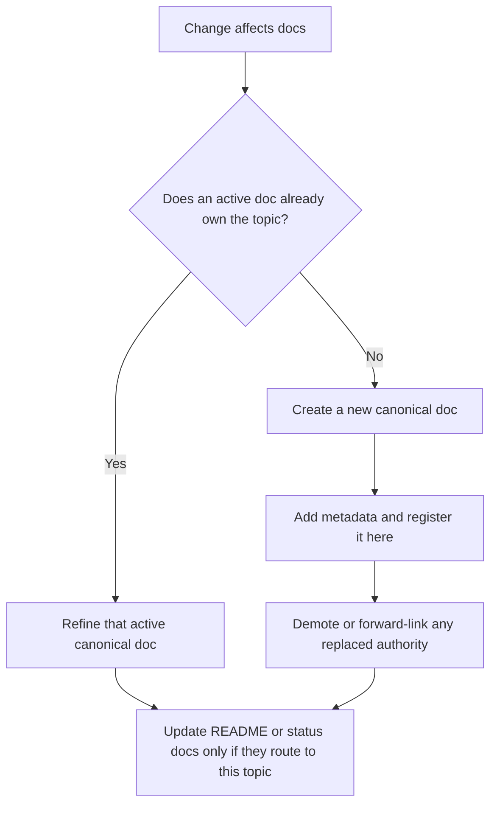

# Documentation Map

Start here when you need to know which Mission Control docs to trust.

## Section Guide

- `Active Docs` are current operational authorities.
- `Reference Docs` explain stable behavior or supporting context.
- `Historical / Design Docs` are preserved context and do not win conflicts.

## Active Docs

- [../VERIFICATION_CHECKLIST.md](../VERIFICATION_CHECKLIST.md): shareable verification contract for a fresh clone or handoff
- [CURRENT_LOCAL_STATUS.md](CURRENT_LOCAL_STATUS.md): canonical truth for this machine and this local checkout
- [LOCAL_OPERATIONS_RUNBOOK.md](LOCAL_OPERATIONS_RUNBOOK.md): short local ops commands for start, health, backup, and cleanup conventions
- [REPOSITORY_POLICY.md](REPOSITORY_POLICY.md): canonical branch, remote, and PR policy for this checkout
- [FORK_DETACH_CHECKLIST.md](FORK_DETACH_CHECKLIST.md): exact admin sequence for converting this GitHub fork into a standalone repo
- [OPENCLAW_RELEASE_IMPACT_AUDIT_2026-04-08.md](OPENCLAW_RELEASE_IMPACT_AUDIT_2026-04-08.md): current OpenClaw `2026.4.8` release-impact audit and local impact checklist
- Current release authority title: `OpenClaw Release Impact Audit 2026-04-08`
- [USER_GUIDE.md](USER_GUIDE.md): operator entrypoint that separates portable setup from machine-local runbooks
- [AUTOPILOT_SETUP.md](AUTOPILOT_SETUP.md): product workspace setup, reset, and operator expectations for Product Autopilot
- [CARD_OPERATIONS_RUNBOOK.md](CARD_OPERATIONS_RUNBOOK.md): correct way to create, dispatch, monitor, and recover Mission Control cards based on the BoreReady failures
- [../README.md](../README.md): upstream/public-facing product guide
- [../ORCHESTRATION.md](../ORCHESTRATION.md): workflow behavior and runtime evidence expectations
- [AGENT_PROTOCOL.md](AGENT_PROTOCOL.md): agent callback and completion-marker contract
- [ORCHESTRATION_WORKFLOW.md](ORCHESTRATION_WORKFLOW.md): orchestration-specific implementation guide

## Reference Docs

- [HOW-THE-PIPELINE-WORKS.md](HOW-THE-PIPELINE-WORKS.md): plain-language stage walkthrough
- [TESTING_REALTIME.md](TESTING_REALTIME.md): realtime verification checklist
- [TROUBLESHOOTING.md](TROUBLESHOOTING.md): 10-entry quick-reference for common local problems (OFFLINE badge, stuck cards, ghost agents, etc.)

## Historical / Design Docs

- [INTEGRATION_FIXES.md](INTEGRATION_FIXES.md): completed milestone summary
- [REALTIME_SPEC.md](REALTIME_SPEC.md): earlier design spec
- [OPENCLAW_RELEASE_IMPACT_AUDIT_2026-04-02.md](OPENCLAW_RELEASE_IMPACT_AUDIT_2026-04-02.md): superseded OpenClaw impact audit kept for dated context
- [archive/status/README.md](archive/status/README.md): archived status snapshots and handovers

## Documentation Conventions

- Keep machine-specific truth in [CURRENT_LOCAL_STATUS.md](CURRENT_LOCAL_STATUS.md), not in upstream/public docs.
- Treat this checkout as a product repo: `origin/main` is the working trunk and `source` is read-only comparison input.
- Keep the reproducible verification gate in [../VERIFICATION_CHECKLIST.md](../VERIFICATION_CHECKLIST.md), not in ad hoc handoff notes.
- Keep local operator commands in [LOCAL_OPERATIONS_RUNBOOK.md](LOCAL_OPERATIONS_RUNBOOK.md), not scattered across status notes.
- Use repo-relative links inside docs.
- Mark docs clearly as `active`, `reference`, or `historical` so readers know what wins in a conflict.
- Archive stale snapshots instead of letting multiple “current status” docs drift in parallel.
- When runtime behavior changes materially, update the docs map plus the affected active doc in the same change.

## Add Or Refine Docs

- Refine the existing canonical doc when the topic owner does not change.
- Create a new canonical doc only when the topic is genuinely new, the old doc would become multi-topic, or authority is intentionally moving.
- If authority moves, demote the old doc in the same change and add `replaced-by` or `supersedes`.
- Every new canonical doc must be registered in this map before merge.

## Foundation Checkpoint

- Documentation foundation checkpoint: `2026-04-08`
- Current runtime-sensitive authority docs:
  - `docs/CURRENT_LOCAL_STATUS.md`
  - `docs/LOCAL_OPERATIONS_RUNBOOK.md`
  - `docs/OPENCLAW_RELEASE_IMPACT_AUDIT_2026-04-08.md`
